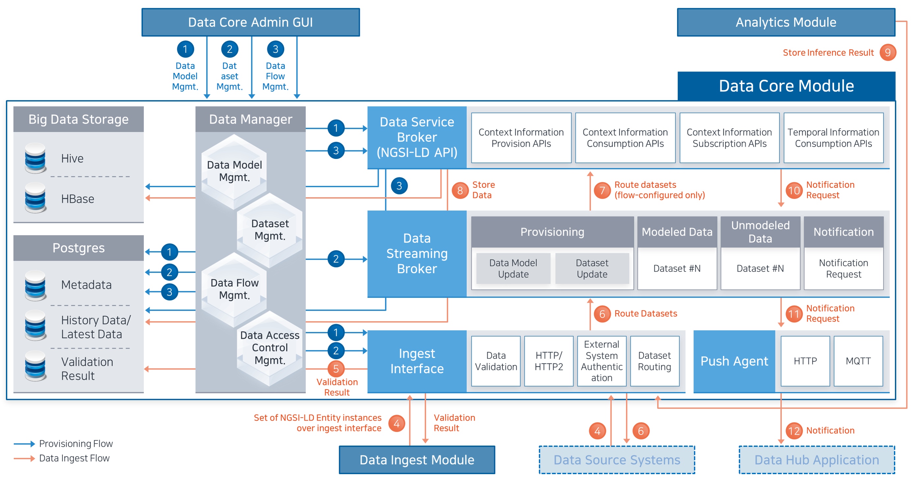

# Data Core Module

데이터 코어 모듈은 데이터 허브 플랫폼의 데이터 모델, 데이터 셋 관리, 저장, 제공, 라이프 사이클 관리, 접근 제어 등 데이터 허브에 저장된 데이터의 전반적인 관리를 위한 기능을 제공합니다.

국제적 상호호환성 및 공신력 확보를 통한 데이터 허브 기반 서비스 생태계 확대를 위해 국제 표준인 NGSI-LD를 준용하여 적용하여 도시 데이터에 대한 최종, 이력 데이터 관리 및 구독/통지, 다양한 검색 항목을 지원합니다.

추가 개발 없이 도시의 다양한 데이터 유형의 데이터를 수용하고, NGSI-LD로 제공할 수 있게 개발을 하여, 신규 데이터 지원이 필요할 경우에도 별도의 개발이 필요하지 않도록 설계 및 개발 하였습니다.

비정형 데이터에 대한 수용도 지원하여, 비정형 데이터에 대한 처리 로직을 개발 적용하면 비정형 데이터 처리를 통한 결과를 데이터 허브에 인입할 수 있는 구조를 지원합니다.

[데이터 코어 모듈 개념도]

<특징>

- 다수의 데이터 저장소 지원 가능
- 데이터 모델 관리 및 데이터 모델 정보 기반한 데이터 저장소 DDL 실행
- 데이터 모델 정보 기반한 국제 표준 기반 NGSI-LD API 처리 로직 실행
- 데이터 셋(데이터 그룹) 별 메타 데이터, 접근 권한 관리
- 수신 데이터에 대한 데이터 모델 기반 검증 처리
- 데이터 셋의 저장 위치(데이터 저장소) 설정 및 해당 데이터 저장소로의 저장 처리
- 반정형, 비정형 데이터 처리 가능
- 원천, 가공, 분석/예측 데이터에 대한 전체 관리 가능
- 데이터에 대한 라이프 사이클 관리

[데이터 코어 아키텍처 및 주요 흐름도]

데이터 코어 모듈은 Data Manager, Data Service Broker, Data Streaming Broker, Ingest Interface, Push Agent, Admin UI, Dashboard로 구성되어 있습니다.

- Data Manager: 데이터 모델 관리, 데이터 셋 관리, 데이터 플로우 관리, 데이터 접근제어 관리, 데이터 생애 주기 등의 데이터 거버넌스 담당
- Data Service Broker: 데이터에 대한 수집, 제공을 담당하며 NGSI-LD API 인터페이스를 통해 기능 제공
- Data Streaming Broker: 메시지큐로 Apache Kafka를 사용하고 있으며, 데이터 셋 별로 토픽이 관리되고 있으며, 이벤트 메시지 및 통지 요청 메시지 토픽이 존재함
- Ingest Interface: 데이터 셋 별 수집 인터페이스를 제공하며, 데이터 셋의 데이터 모델에 따라 데이터 검증 기능 제공, 외부 데이터 소스에 대한 인증 기능 제공
- Push Agent: 데이터 구독에 따른 NGSI-LD 기반 통지 메시지를 전송 기능 제공
- Admin UI: 데이터 코어 관리자용 UI로써 데이터 모델 관리, 데이터 셋 관리, 데이터 흐름 관리, 접근 제어 관리 및 외부 데이터 소스 플랫폼 정보 관리, 수집 데이터에 대한 처리 이력 조회 기능 제공
- Dashboard: 데이터 코어 모듈에 저장된 데이터를 조회할 수 있고, 위젯 기반의 대시보드를 제공하여 사용자 별 대시보드 구성을 할 수 있는 환경 제공

[데이터 저장소 연계]

데이터 코어 모듈은 데이터 셋 별로 데이터 저장소를 선택할 수 있습니다. 기본적으로는 PostgreSQL을 제공하며, bigdatastorage 설치를 통해 Hadoop 기반 Hive, HBase 저장소를 추가로 설정할 수 있습니다. 어떤 저장소를 사용하는지와는 무관하게 데이터에 대한 조작 및 제공 API는 NGSI-LD 인터페이스로 제공할 수 있습니다.

