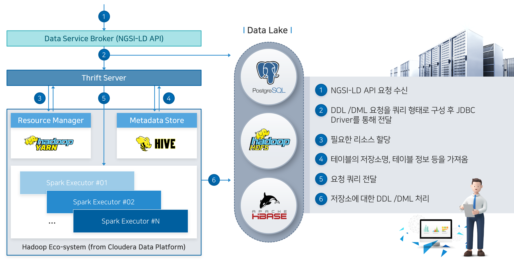

# 1. BigDataStorageHandler 개요

BigDataStorageHandler는 데이터 허브 플랫폼에 적재된 데이터에 대한 저장, 처리, 분석 처리를 지원합니다. 또한 공간 연산과 좌표 정보를 포함한 공간 데이터의 인덱싱 처리를 지원하고, 대량의 데이터베이스를 위한 공간 데이터의 저장, 처리, 분석를 제공합니다.

 

## 1.1. BigdataStorageHandler의 동작원리

BigDataStorageHandler는 Data Service Broker로부터의 Big Data(Hive, HBase) 처리 요청을 담당하는 STS(Spark Thrift Server)를 구성해주는 역할을 합니다.
여기서 STS란 Apache Spark이 자체적으로 구현해주는 Hive Server2 혹은 Hive Server2의 Spark SQL port로 정의하며, Data Service broker가 보낸 SQL query 요청을 Apache Spark 위에서 JDBC/ODBC 프로토콜을 통해 처리해주는 역할을 합니다.

 

## 1.2. Thrift 서버와 Data Core 간 연결

Thrift 서버는 Data Core의 Data Service Broker와 JDBC/ODBC 프로토콜을 통해 연결되어 있습니다.

 

