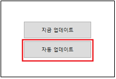

# 3.1 overview
- This document is a user guide for the data provision function loaded through the smart city data hub Big Data Storage Handler.
- The purpose of document is to provide a spatial query guide for using the JDBC driver and analyzing spatial data.

# 3.2 JDBC Driver User Guide
## 3.2.1 Hive-JDBC Driver Download
 If the application does not include the Hive-JDBC Driver or is not a JVM-based language, a separate Hive-JDBC Driver library must be downloaded.

- How to download Hive JDBC Driver library
    - Hive-JDBC Driver does not provide a separate download, but is included in the package when you download Hive ([Hive package download link](https://downloads.apache.org/hive/))
    - There is a **{HIVE-HOME} -> jdbc -> hive-jdbc-{version}-standalone.jar** file in the package. You can use the Jar file by registering it.
  

- Get Hive JDBC Standalone right away
  - In some cases, standalone is missing from the Hive distribution version, so a link has been added.
    - [jdbc-1.2.1](https://repo1.maven.org/maven2/org/apache/hive/hive-jdbc/1.2.1/)
    - [jdbc-2.3.8](https://repo1.maven.org/maven2/org/apache/hive/hive-jdbc/2.3.8/)
    - [jdbc-3.1.2](https://repo1.maven.org/maven2/org/apache/hive/hive-jdbc/3.1.2/)

## 3.2.2 Guide to using Hive-JDBC Driver in programming language

**(1) JAVA**

<pom.xml>
```
<dependency>
    <groupId>org.apache.hive</groupId>
    <artifactId>hive-jdbc</artifactId>
    <version>{hive-version}</version>
</dependency>
```

<source code>
```
private static String driver = "org.apache.hive.jdbc.HiveDriver";
String url = "jdbc:hive2://<hive_server_url>:10000/default";
String user = "hive";
String password = "hive";

try {
    Class.forName(driver);
}
catch (ClassNotFoundException e) {
    e.printStackTrace();
    System.exit(1);
}

Connection connection = null;
Statement statement = null;

try {
    DriverManager.getConnection(url);
    connection = DriverManager.getConnection(url, user, password);
    statement = connection.createStatement();
    statement.execute("select * from <table_name>;");
    connection.close();
} catch (SQLException e) {
    e.printStackTrace();
    System.exit(1);
}
```

**(2) Python**

<package installation>
```
(in CLI environment) pip install JayDeBeApi
```

<source code>
```
import jaydebeapi

driver = "org.apache.hive.jdbc.HiveDriver"

url = "jdbc:hive2://<hive_server_url>:10000/default"
user="hive"
password="hive“

jar_path = “<path_to_hive_home>/jdbc/"
file_list = os.listdir(jar_path)

jars = [jar_path+file for file in file_list if file.endswith(".jar")]

connection = jaydebeapi.connect(jclassname = driver, 
                                 url = url, 
                                 jars = jars, 
                                 driver_args = {"user" : user, "password" : password})
cursor = connection.cursor()

cursor.execute("select * from <table_name>;“)
```

**(3) R**

<package installation>
```
(in RStudio console)
install.packages("rJava")
install.packages("RJDBC")
```

<source code>
```
class.path = c(list.files(path = "<path_to_hive_home>/jdbc/", pattern = "jar", full.names = T))

.jinit(classpath = class.path)

driver = "org.apache.hive.jdbc.HiveDriver"

url = "jdbc:hive2://<hive_server_url>:10000/default"
user="hive"
password="hive"

drv = JDBC(driver)

connection = dbConnect(drv, url, user, password)

dbGetQuery(conn = connection, "select * from <table_name>;")
```

##3.2.3 Guide to using Hive-JDBC Driver in Squirrel SQL Client
 SQuirreL SQL Client is one of the database management tools, it uses Hive-JDBC Driver to explore and interact with various repositories.
 
1. Register Hive-JDBC Driver
	- Register the downloaded Hive-JDBC Driver in SQuirreL SQL Client.

		

		[3] Specify the driver name and Example URL to be added. In this case, write an example of a Connection URL or a Connection URL to be actually used in Example URL.
			
			Connection URL format: jdbc:[Subprotocol]://[Host]:[Port]/[Schema];[Property1]=[Value];[Property2]=[Value];...

			Example) jdbc:hive2://localhost:11000/default
			
		[5] In the Add Driver of the Driver tab, add the **{HIVE-HOME} -> jdbc -> hive-jdbc-{version}-standalone.jar** file of the downloaded Hive package to the Extra Class Path.
		
		[6] Set class name to **org.apache.hive.jdbc.HiveDriver**

2. Create Alias
	- Create an alias through the registered driver.

		

		[1] In the Add Alias tab of the Aliases tab, select the Alias name to be added and the Driver to be added (kaia-hive in the picture above) and click the Connect button after confirming the URL (change the URL if necessary)

		[3] Click the Connect button and enter User/Password information
		

3. Write SQL query and check result
	- If the corresponding Alias Add window disappears, the screen as shown below appears. In the Objects tab of the screen, you can check information about the relevant Hive, and in the SQL tab, you can write SQL and check the query results.
		
		
 
##3.2.4 Guide to using Hive-JDBC Driver in NiFi
 - Access the NiFi WebUI.
   - Example) http://localhost:8080/nifi
 - Since JDBC Connector can be set in NiFi Flow Configuration, click the gear icon to access Flow Configuration.
  **※ Be sure to check that the word NiFi Flow appears on the Operate palette. If the name of another processor is displayed, enter the configuration for that process**
   
   

 - In the Flow Configuration, click the CONTROLLER SERVICES tab and then click the + sign in the upper right corner.

  

 - In the Add Controller Service, enter Hive in the search bar, select HiveConnectionPool, and click the Add button.

  

 - Click the Configure button for the newly created HiveConnectionPool.

  

 - In the PROPERTIES tab of the Configure Controller Service, enter the JDBC Driver URL information, enter the user name and password, and then click the APPLY button.

  

 - If you click the Enable button (red box), the corresponding ConnectionPool is activated.

  
 
 - The linked Hive JDBC driver can be tested using 3 processors as shown in the figure below. The linked JDBC Driver can be used by registering in the PROPERTIES tab of the Configure window of the SelectHiveQL processor.

  

 - To check the test result, "Right click on LogAttribute Processor" -> "Click View Data Provenance" -> "Click View Details" -> "Click the VIEW button in the CONTENT tab" -> Check the result

  

# 3.3 Guide to Visualizing Spatial Data in Tableau

## Install Tableau
- Installation URL: [Tableau Desktop download link] (https://www.tableau.com/ko-kr/products/desktop)

## Install Spark SQL Driver for Tableau
- Tableau provides drivers that can work with various repositories, but not all drivers are included in Tableau, and only the necessary drivers can be installed. Therefore, in order to access via Spark SQL, ***you need to install the Spark SQL Driver provided by Tableau.***
- Spark SQL Driver download URL for Tableau: [Tableau Spark SQL Driver download link](https://www.tableau.com/ko-kr/support/drivers?edition=pro&lang=ko-kr&platform=windows&cpu=64&version=2020.3&__full-version=20203.20.1110.1623#spark)
    
    
    
    - Download the driver for Tableau Desktop and Tableau Server for each operating system and bit version.
- Execute the downloaded SimbaSpark1.2-xx-bit.msi file to install Spark SQL Driver

## Import spatial data from Tableau
### Thrift server integration for JDBC driver 드라이버용 스리프트 서버 연동
- Running Tableau -> Right menu in Tableau -> Click More... -> Select Spark SQL

    

- Connect after entering server information and port information in the Spark SQL connection

    

    - If an error occurs, select a user name for the authentication method and retry after entering the user name (ex. hive)

### Select schema
- The method of selecting the schema containing the data to be displayed is as follows.

    

### select table 

- The method of selecting a table containing data to be displayed is as follows.

    

    - You can select the table by double-click or drag.

    

### SQL modification

- Change the existing query statement to a form that can be recognized by the Thrift server

    1. Select the table and select `Convert to custom SQL`
    
        

    2. Modify the query statement
        - Remove the grave sign (`)
        - Remove database name from table name
        - Query to extract longitude and latitude values ​​of fields to be displayed: use ST_X, ST_Y functions
            - When the field is in the form of Well Known Binary
                - After converting to a spatial object using the ST_GeomFromWKB function, apply the ST_X and ST_Y functions
            - When the field is in the form of Well Known Text
                - After converting to a spatial object using the ST_GeomFromWKT or ST_GeomFromText function, apply the ST_X, ST_Y functions
            ```
            (example)
                SELECT
                    ST_X(ST_GeomFromWKT(<table name>.<field name>)) AS <field name>_x,
                    ST_Y(ST_GeomFromWKT(<table name>.<field name>)) AS <field name>_y
                FROM
                    <table name>
            ```

    3. Select Auto Update after applying the modified query statement, you can check the data to which the modified query is applied.

        

## Visualize spatial data

### Change spatial data type
- Since the extracted X and Y coordinates are recognized as simple numbers, they cannot be used on the map.
Therefore, it is necessary to change the X and Y coordinates to a type that plays a geographical role rather than a number.
The method of changing the type of spatial data X and Y is as follows.

    

- Coordinates X and Y transmitted through the Thrift server mean longitude and latitude, respectively, in the latitude and longitude coordinate system.
    - <field name>_x -> longitude, <field name>_y -> latitude


### matching

1. Select sheet 1 in the lower left corner and go to the worksheet

2. Visualize fields (ex. <field name>_x, <field name>_y) that have latitude and longitude roles that have been assigned geographic roles.
Drag and drop fields that act as longitudes to columns and fields that act as latitudes to rows

    

3. If it is a measure (average), change it to a dimension

    

### Visualization result
- The visualization result is as follows
    
    

#3.4 Spatial Query Guide
##3.4.1 Constructor

**ST_GeomFromWKT:**
A query to convert a WKT string to a spatial object. You can add an unlimited number of UUID strings.
```
Format) ST_GeomFromWKT (Wkt:string, UUID1, UUID2, ...)
Example) SELECT ST_GeomFromWKT('POLYGON ((30 10, 40 40, 20 40, 10 20, 30 10))') AS geometry
```
**ST_GeomFromWKB:**
A query to convert a WKB string to a spatial object. You can add an unlimited number of UUID strings.
```
Format) ST_GeomFromWKB (Wkb:string, UUID1, UUID2, ...)
Example) SELECT ST_GeomFromWKB('000000000140000000000000004010000000000000')
```
**ST_PointFromText:**
A query that returns a Point space object by splitting the given text by the given delimiter. You can add an unlimited number of UUID strings.
```
Format) ST_PointFromText (Text:string, Delimiter:char, UUID1, UUID2, ...)
Example) SELECT ST_PointFromText('40.7128,-74.0060', ',') AS pointshape
```
##3.4.2 Function

**ST_Distance:**
Query to calculate distance between two spatial objects
```
Format) ST_Distance (A:geometry, B:geometry)
Example) SELECT ST_Distance(geom_1, geom_2) FROM <table name>
```
**ST_Envelope:**
Query to create a rectangular envelope enclosing a spatial object
*Envelope: A spatial object representing a rectangle with two points.
```
Format) ST_Envelope (A:geometry)
Example) SELECT ST_Envelope(geom) from <table name>
```
**ST_Length:**
Query to return the length of a spatial object
```
Format) ST_Length (A:geometry)
Example) SELECT ST_Length(geom) FROM <table name>
```
**ST_Area:**
Query to return the area of ​​a spatial object
```
Format) ST_Area (A:geometry)
Example) SELECT ST_Area(geom) FROM <table name>
```
**ST_Centroid:**
A query that calculates the center of gravity of a spatial object.
```
Format) ST_Centroid (A:geometry)
Example) SELECT ST_Centroid(geom) FROM <table name>
```
**ST_Transform:**
Query to transform the coordinate system of a spatial object
```
Format) ST_Transform (A:geometry, SourceCRS:string, TargetCRS:string, [Optional] UseLongitudeLatitudeOrder:Boolean, [Optional] DisableError)
Example) SELECT ST_Transform(geom, 'epsg:4326', 'epsg:3857') FROM <table name>
```
**ST_Intersection:**
A query that returns the overlapping spatial object of spatial object A and spatial object B
```
Format) ST_Intersection (A:geometry, B:geometry)
Example) SELECT ST_Intersection(geom_1, geom_2) FROM <table name>
```
**ST_Buffer:**
A query that returns a spatial object representing all points whose distance from the spatial object is less than or equal to a given distance.
```
Format) ST_Buffer (A:geometry, buffer: Double)
Example) SELECT ST_Buffer(geom, 1) FROM <table name>
```
**ST_AsText:**
Query returning a WKT string representing a spatial object
```
Format) ST_AsText (A:geometry)
Example) SELECT ST_AsText(geom) FROM <table name>
```
**ST_GeometryType:**
A query that returns the class of a spatial object
```
Format) ST_GeometryType (A:geometry)
Example) SELECT ST_GeometryType(geom) FROM <table name>
```
##3.4.3 Predicate

**ST_Contains:**
Query that returns true if spatial object B is inside spatial object A
```
Format) ST_Contains (A:geometry, B:geometry)
Example) SELECT * FROM <table name>
          WHERE ST_Contains(geom, ST_PolygonFromEnvelope(1.0,0.0,30.0,30.0))
```
**ST_Intersects:**
A query that returns true if two spatial objects intersect or touch at any point.
```
Format) ST_Intersects (A:geometry, B:geometry)
Example) SELECT * FROM <table name>
          WHERE ST_Intersects(geom, ST_PolygonFromEnvelope(1.0,0.0,30.0,30.0))
```
**ST_Within:**
Query that returns true if spatial object A is inside spatial object B
```
Format) ST_Within (A:geometry, B:geometry)
Example) SELECT * FROM <table name>
          WHERE ST_Within(geom, ST_PolygonFromEnvelope(1.0,0.0,30.0,30.0))
```
**ST_Equals:**
Query that returns true if two spatial objects are equal to each other
```
Format) ST_Equals (A:geometry, B:geometry)
Example) SELECT * FROM <table name>
          WHERE ST_Equals(geom, ST_PolygonFromEnvelope(1.0,0.0,30.0,30.0))
```
**ST_Crosses:**
A query that returns true if two spatial objects intersect each other. Cases that meet only at the boundary are not included.
```
Format) ST_Crosses (A:geometry, B:geometry)
Example) SELECT * FROM <table name>
          WHERE ST_Crosses(geom, ST_PolygonFromEnvelope(1.0,0.0,30.0,30.0))
```
**ST_Touches:**
Query that returns TRUE if two spatial objects meet along a point or boundary, but do not intersect inside.
```
Format) ST_Touches (A:geometry, B:geometry)
Example) SELECT * FROM <table name>
          WHERE ST_Touches(geom, ST_PolygonFromEnvelope(1.0,0.0,30.0,30.0))
```
**ST_Overlaps:**
A query that returns TRUE if spatial object A shares space with spatial object B, but is not completely contained within that object. It must overlap inside, and it does not include cases where two objects meet at a point or intersect along a boundary. Both spatial objects must have the same dimension.
```
Format) ST_Overlaps (A:geometry, B:geometry)
Example) SELECT * FROM <table name>
          WHERE ST_Overlaps(geom, ST_PolygonFromEnvelope(1.0,0.0,30.0,30.0))
```
##3.4.4 Join

**Range Join:**
A query execution method to find a spatial object pair that satisfies a specific predicate among spatial object pairs obtained from A and B, respectively. Most Predicates supported by GeoSparkSQL can be used.
```
Format) SELECT * 
         FROM <table name 1>, <table name 2>
         WHERE <Predicate>(<table name1>.geom, <table name2>.geom)
Example) SELECT *
          FROM polygondf, pointdf
          WHERE ST_Contains (ST_GeomFromWKT (polygondf.geom), ST_GeomFromWKT (pointdf.geom))
```
**Distance Join:**
Query execution method to find a pair of spatial objects that have a distance less than or equal to a specific distance among pairs of spatial objects obtained from A and B, respectively
```
Format) SELECT * 
         FROM <table name 1>, <table name 2> 
         WHERE ST_Distance(<table name1>.geom, <table name2>.geom) <= <distance>
Example) SELECT *
          FROM polygondf, pointdf
          WHERE ST_Distance (ST_GeomFromWKT (polygondf.geom), ST_GeomFromWKT (pointdf.geom)) < 2
```
